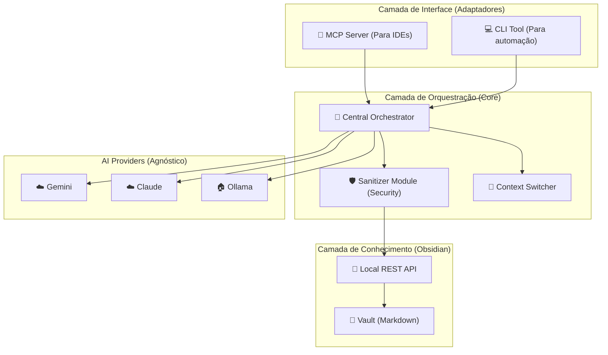

# 📖 DOCUMENTO DE PROJETO — DANGER LINE

## Ecossistema de Inteligência Agnóstico e Gestão de Conhecimento (KB)

---

## 1. Visão Estratégica

### 1.1 O Sistema
O **Danger Line** evoluiu para ser um **Ecossistema de Inteligência Agnóstico (EIA)**. Ele atua como um cérebro digital para o desenvolvedor, capturando, higienizando e destilando conhecimento técnico para ser reutilizado por qualquer IA (Claude, Gemini, GPT, Ollama) e em qualquer ambiente (VS Code, Cursor, CLI).

### 1.2 Princípios Fundamentais
1.  **Agnosticismo Total**: Independente de IDE ou Provedor de IA.
2.  **Zero Footprint & Centralização**: Nenhum arquivo residual em projetos; tudo centralizado no Obsidian.
3.  **Segurança em Primeiro Lugar**: Sanitização automática de dados sensíveis antes da persistência.
4.  **Múltiplos Contextos (Multi-Brains)**: Alternância fluida entre especializações (Backend, Frontend, etc.).

---

## 2. Arquitetura do Sistema

### 2.1 Diagrama de Camadas (Headless Architecture)

---

## 3. Módulos Estratégicos

### 3.1 Módulo Sanitizer (Segurança)
Responsável por garantir a privacidade do desenvolvedor. Ele remove segredos, chaves de API e dados de conexão antes de qualquer dado tocar o Obsidian. (Detalhes na **IDEIA-3**).

### 3.2 Módulo Context Switcher (Múltiplos Cérebros)
Permite que o sistema alterne entre "bases de dados mentais" especializadas. Ex: Ao trabalhar em um React App, o sistema foca no contexto de Frontend e padrões UI, sem poluir com regras de infraestrutura. (Detalhes na **IDEIA-4**).

### 3.3 Módulo Obsidian (Knowledge Engine)
Utiliza o Obsidian não apenas como storage, mas como uma engine de inteligência através de plugins como Dataview e Local REST API. (Detalhes na **IDEIA-1**).

---

## 4. Metodologia de Captura KB

O sistema abandona a classificação por estrelas e adota a **Captura de Modelos Mentais**:
- **Specs**: Como as coisas funcionam tecnicamente.
- **Playbooks**: Scripts de ação para problemas recorrentes.
- **Dívidas**: Áreas de risco ou código que precisa de atenção futura.

---

## 5. Glossário

| Termo | Definição |
|-------|-----------|
| **Agnóstico** | Capacidade de trocar de IA ou IDE sem quebrar o sistema. |
| **Sanitizer** | Filtro de segurança que remove dados sensíveis. |
| **Context Switch** | Troca de foco do sistema entre especialidades (Backend/Frontend). |
| **Playbook** | Conjunto de regras e soluções extraídas do seu próprio histórico. |
| **Zero Footprint** | Filosofia de não criar arquivos extras nas pastas dos projetos. |
