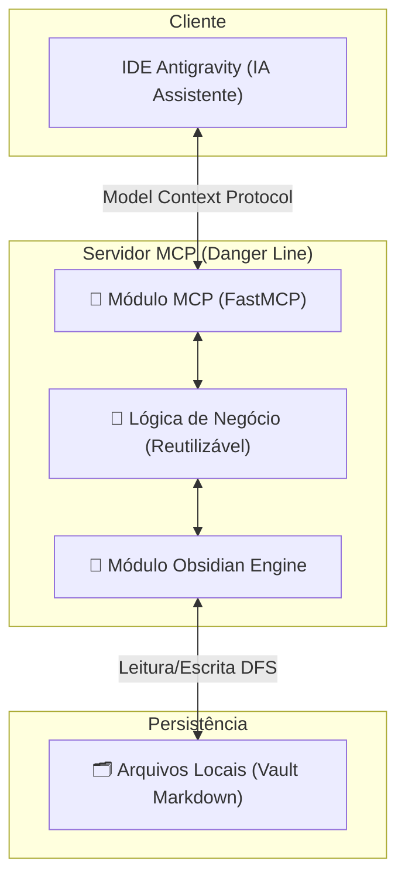

# 📖 DOCUMENTO DE PROJETO — DANGER LINE

## Ecossistema MCP para Knowledge Base no Obsidian

---

## 1. Visão Estratégica

### 1.1 O Sistema
O **Danger Line** foi simplificado e refatorado para atuar **exclusivamente como um Servidor MCP (Model Context Protocol)**. Sua única missão é conectar a inteligência da IDE (Antigravity) ao cérebro digital centralizado do desenvolvedor: o **Obsidian**.

Ao remover complexidades (como LLMs intermediários, APIs externas e CLI standalone), o sistema foca em estabilidade, performance e na construção de um fluxo de conhecimento fluido e bidirecional.

### 1.2 Princípios Fundamentais
1. **Foco Único (MCP-Only)**: Nenhuma interface extra. A interação ocorre 100% via ferramentas (Tools) e recursos (Resources) acionados pela IA assistente (Antigravity).
2. **Obsidian como Único Banco de Dados**: Todo o conhecimento é persistido e lido diretamente de um vault local do Obsidian, sem bancos de dados paralelos.
3. **Zero Footprint**: O código dos projetos do desenvolvedor permanece intocado. O contexto fica no Obsidian.
4. **Classes Reutilizáveis (Default Classes)**: A arquitetura do código é construída usando classes padronizadas para facilitar a expansão futura (ex: `ObsidianVaultManager`, `MarkdownParser`).

---

## 2. Arquitetura do Sistema

### 2.1 Diagrama de Arquitetura Simplificada

---

## 3. Módulos do Sistema

### 3.1 Módulo MCP (Interface de Comunicação)
O ponto de entrada e saída. Define de forma limpa as ferramentas que a IA da IDE pode usar.
- Ferramentas (Tools) expostas: `query_kb`, `commit_knowledge`.
- Utiliza a biblioteca base do protocolo, instanciando classes que encapsulam os handlers de requisição.

### 3.2 Módulo Obsidian Engine
Responsável por gerenciar os arquivos locais sem depender de APIs externas pesadas.
- **Leitura/Escrita**: Interação com arquivos `*.md` baseada em caminhos absolutos no sistema de arquivos.
- **Indexação**: Navegação nas pastas (ex: `/Bugfixes`, `/Padrões_Arquitetura`) para montar o contexto requerido.
- Utiliza classes genéricas para interagir com o Frontmatter (YAML) e manter a formatação do Obsidian (`[[wikilinks]]`).

---

## 4. Metodologia de Captura KB

Todo o peso de identificar, classificar e resumir código passa a ser **responsabilidade da IA assistente (Antigravity)**.
O Danger Line foca em como **armazenar** e **recuperar** esse conhecimento:
- **Padrões de Arquitetura**: Como as coisas foram desenhadas neste projeto.
- **Resoluções de Bugs**: Registros das falhas e como foram consertadas.
- **Dívidas Técnicas**: Pontos de atenção que a IA descobriu e salvou para o futuro.

---

## 5. Glossário

| Termo | Definição |
|-------|-----------|
| **MCP (Model Context Protocol)** | Protocolo padrão usado pela Antigravity para chamar ferramentas no sistema local. |
| **Obsidian Engine** | Componente interno que traduz chamadas do MCP para arquivos Markdown compreensíveis pelo aplicativo Obsidian. |
| **Classes Reutilizáveis** | Padrão arquitetural focado em herança e componentes genéricos para leitura/escrita e formatação. |
| **DFS (Direct File System)** | Manipulação direta dos arquivos `.md` locais do vault do Obsidian. |
