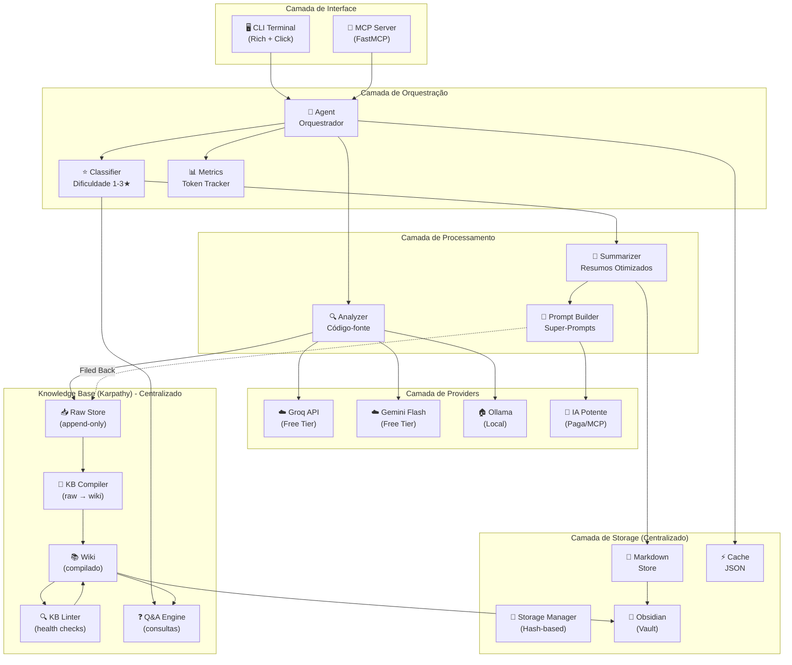
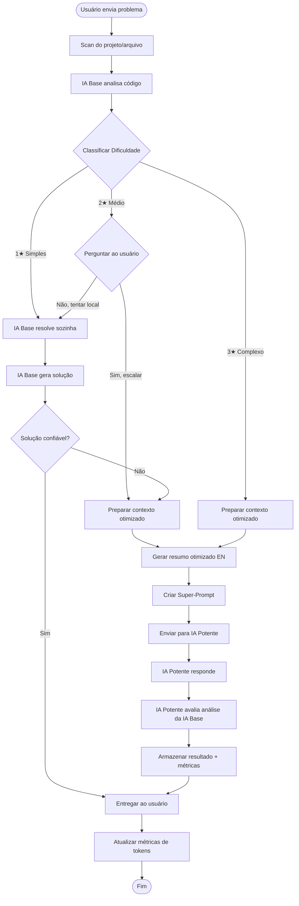
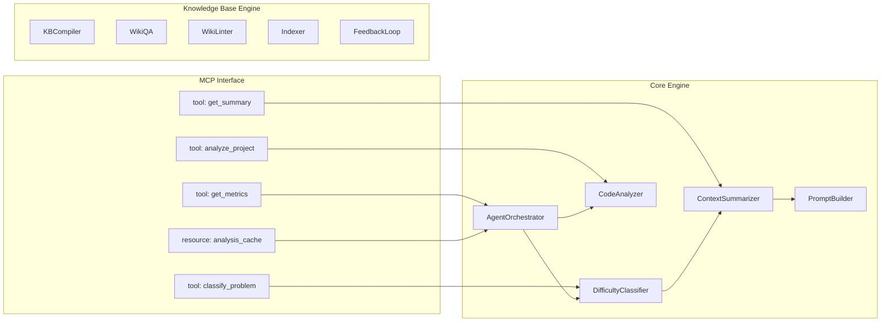
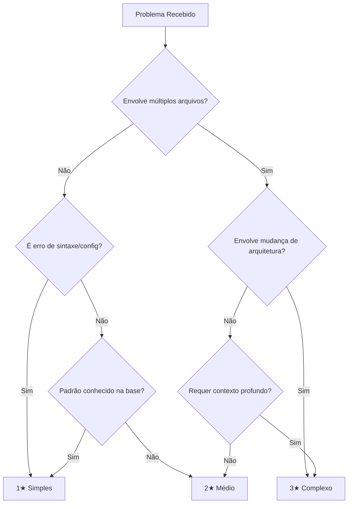
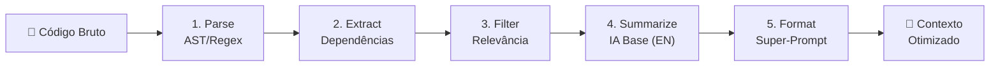
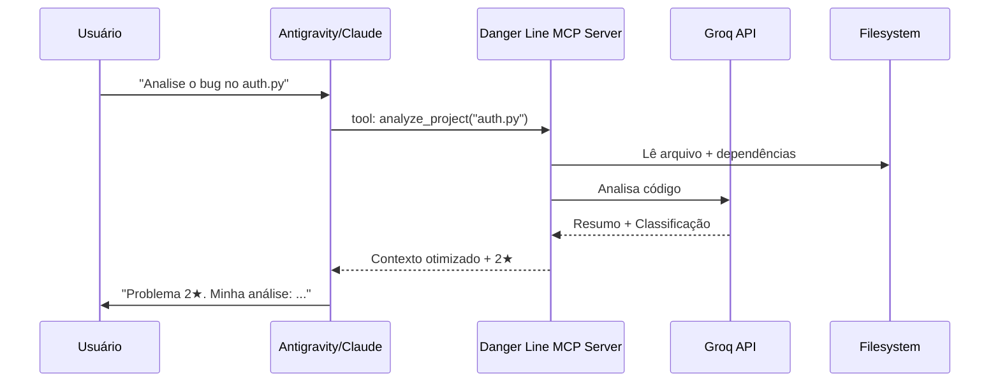
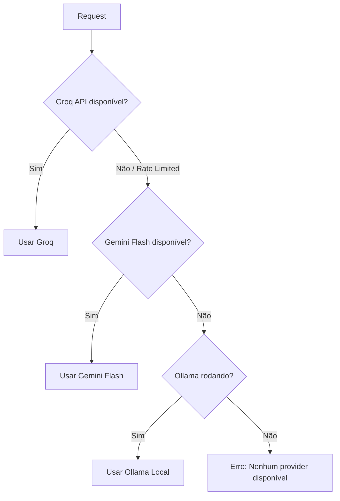

# 📖 DOCUMENTO DE PROJETO — DANGER LINE v2

## Sistema Administrativo e Assistente com IA Base para Buscas e Resumos

---

## 1. Introdução

### 1.1 Contexto

Desenvolvedores que utilizam IAs pagas (Claude, GPT-4, Gemini Pro) para auxiliar na programação enfrentam custos significativos de tokens. Grande parte do contexto enviado é bruto, redundante e poderia ser pré-processado por uma IA mais simples e gratuita.

O **Danger Line v2** atua como um **intermediário inteligente**: uma camada de pré-processamento que utiliza IAs gratuitas para analisar, classificar e resumir código antes de encaminhar apenas o essencial para a IA paga.

### 1.2 Objetivos

1. **Reduzir o consumo de tokens** da IA paga em pelo menos 50%
2. **Automatizar análises** de código-fonte com IA gratuita
3. **Classificar complexidade** de problemas por nível de dificuldade
4. **Gerar contexto otimizado** seguindo melhores práticas para consumo por IA
5. **Integrar nativamente** com ferramentas de desenvolvimento via MCP
6. **Monitorar e reportar** economia de tokens

### 1.3 Público-Alvo

Desenvolvedores técnicos que utilizam IAs pagas como assistentes de programação e desejam otimizar custos sem perder qualidade.

---

## 2. Arquitetura do Sistema

### 2.1 Diagrama de Arquitetura Geral



### 2.2 Diagrama de Fluxo Principal



### 2.3 Diagrama de Componentes



---

## 3. Sistema de Classificação por Estrelas

### 3.1 Definição dos Níveis

| Nível | Símbolo | Descrição | Ação | Exemplos |
|-------|---------|-----------|------|----------|
| **1★** | ⭐ | Problema simples, padrão conhecido | IA Base resolve sozinha | Erros de sintaxe, imports faltando, typos, formatação |
| **2★** | ⭐⭐ | Problema intermediário, requer análise | IA Base elabora solução + pede confirmação para escalar | Bugs de lógica simples, refatoração pequena, config issues |
| **3★** | ⭐⭐⭐ | Problema complexo, requer IA potente | Escala direto para IA potente com contexto otimizado | Arquitetura, bugs complexos, otimização de performance |

### 3.2 Critérios de Classificação



### 3.3 Fluxo de Decisão para 2★

Para problemas classificados como 2★, o sistema implementa um **fluxo de consentimento**:

1. IA Base analisa o problema e elabora uma solução candidata
2. IA Base gera um resumo detalhado para a IA potente
3. Sistema pergunta ao usuário: _"Problema classificado como 2★. Deseja escalar para IA potente? (Y/n)"_
4. Se **sim**: envia contexto otimizado para IA potente
5. Se **não**: IA Base tenta resolver e apresenta solução com disclaimer de confiança

**Importante**: Mesmo sem escalar, problemas 1-2★ resolvidos pela IA Base são **posteriormente revisados em batch** pela IA potente (quando conveniente), que emite um "alvará" de qualidade e sugere melhorias.

---

## 4. Sistema de Otimização de Contexto

### 4.1 Pipeline de Processamento



### 4.2 Formato do Contexto Otimizado (Para IA)

O contexto gerado para consumo pela IA potente segue as melhores práticas:

```markdown
### CONTEXT ARCHITECTURE — DANGER LINE AGENT ###

**NEGATIVE PROMPT**: Do NOT explain basic concepts. Do NOT repeat the code.
Do NOT suggest generic solutions. Focus on the SPECIFIC problem.

---
#### 1. PROJECT OVERVIEW
- Language: {language}
- Framework: {framework}
- Architecture: {pattern}

#### 2. RELEVANT FILES
{tree_of_relevant_files_only}

#### 3. CODE CONTEXT
```{language}
{filtered_code_with_annotations}
```

#### 4. DEPENDENCY CHAIN
{dependency_graph}

#### 5. PROBLEM CLASSIFICATION
- Difficulty: {stars}★
- Category: {category}
- Base AI Assessment: {summary}

#### 6. SPECIFIC TASK
{user_original_question}

---
#### INSTRUCTIONS FOR PERFORMANCE AI
- This context was pre-processed by a base AI.
- Focus on: {specific_focus_areas}
- Verify: {base_ai_solution_if_any}
- Respond with: code changes, explanation of WHY, architecture implications

[END CONTEXT — DANGER LINE AGENT]
```

### 4.3 Formato do Resumo (Para Humano)

Para o usuário técnico, os resumos são gerados em **Markdown** com padrões de documentação de arquitetura:

- Escrita técnica em PT-BR
- Diagramas Mermaid embutidos
- Seções padronizadas (Contexto, Análise, Solução, Impacto)
- Tags e metadados no frontmatter (Obsidian-compatible)

---

## 5. Integração MCP (Model Context Protocol)

### 5.1 Como Funciona

O Danger Line expõe suas funcionalidades como **tools MCP**, permitindo que qualquer IA compatível (Antigravity, Claude Desktop, Gemini CLI) as utilize diretamente.



### 5.2 Tools Expostas via MCP

| Tool | Parâmetros | Descrição |
|------|-----------|-----------|
| `analyze_file` | `path: str` | Analisa um arquivo e retorna resumo otimizado |
| `analyze_project` | `path: str, depth: int` | Mapeia e analisa projeto completo |
| `classify_problem` | `description: str, files: list` | Classifica dificuldade (1-3★) consultando wiki |
| `get_optimized_context` | `problem: str, files: list` | Gera super-prompt otimizado com contexto do wiki |
| `get_metrics` | — | Retorna métricas de tokens, economia e wiki stats |
| `search_analyses` | `query: str` | Busca em análises anteriores salvas |
| `compile_knowledge` | — | Processa raw/ e atualiza wiki/ |
| `query_knowledge` | `query: str` | Q&A sobre o wiki compilado |
| `lint_wiki` | — | Health check do wiki |
| `get_project_card` | `project: str` | Retorna/gera Project Card do projeto |
| `get_known_patterns` | `project: str` | Lista patterns conhecidos |
| `get_known_bugs` | `project: str` | Lista bugs e soluções anteriores |

### 5.3 Configuração no Antigravity

Arquivo: `~/.gemini/antigravity/mcp_config.json`

```json
{
  "mcpServers": {
    "danger-line": {
      "command": "uv",
      "args": ["run", "python", "C:/path/to/Danger_line/src/mcp/server.py"],
      "env": {
        "GROQ_API_KEY": "your-key",
        "WORKSPACE_PATH": "C:/path/to/your/project"
      }
    }
  }
}
```

---

## 6. Sistema de Métricas e Painel de Controle

### 6.1 Métricas Rastreadas

| Métrica | Descrição | Cálculo |
|---------|-----------|---------|
| `tokens_saved` | Tokens economizados | `estimated_raw - actual_sent` |
| `tokens_spent_base` | Tokens gastos na IA base | Soma de input+output da Groq |
| `tokens_spent_premium` | Tokens gastos na IA potente | Soma de input+output do external |
| `savings_percentage` | % de economia | `(tokens_saved / estimated_raw) * 100` |
| `problems_by_star` | Distribuição por dificuldade | Contagem por classificação |
| `accuracy_score` | Precisão das classificações | Feedback da IA potente |

### 6.2 Layout do Painel (Terminal)

```
╔══════════════════════════════════════════════════════════╗
║              🔴 DANGER LINE — PAINEL DE CONTROLE        ║
╠══════════════════════════════════════════════════════════╣
║                                                          ║
║  📊 ECONOMIA DE TOKENS                                   ║
║  ┌────────────────────────────────────────┐               ║
║  │ Economizados:  12,450 tokens  (62%)   │               ║
║  │ ████████████████████░░░░░░░░░░░░░░░░  │               ║
║  └────────────────────────────────────────┘               ║
║                                                          ║
║  💰 CONSUMO                                              ║
║  ├─ IA Base (Groq):     3,200 tokens                    ║
║  ├─ IA Potente:         4,500 tokens                    ║
║  └─ Total estimado sem DL: 20,150 tokens                ║
║                                                          ║
║  ⭐ DISTRIBUIÇÃO                                         ║
║  ├─ 1★ Simples:   15 problemas (60%)                    ║
║  ├─ 2★ Médio:      7 problemas (28%)                    ║
║  └─ 3★ Complexo:   3 problemas (12%)                    ║
║                                                          ║
║  🏆 AVALIAÇÃO DA IA POTENTE                              ║
║  ├─ Precisão das análises: 85%                           ║
║  ├─ Sugestões de melhoria: 3 pendentes                   ║
║  └─ Última revisão: 2026-05-04 18:30                     ║
║                                                          ║
╚══════════════════════════════════════════════════════════╝
```

---

## 7. Estratégia de Providers (IA Base)

### 7.1 Chain of Fallback



### 7.2 Provider Selection por Tarefa

| Tarefa | Provider Ideal | Fallback |
|--------|---------------|----------|
| Classificação 1-3★ | Groq (Llama 8B) — rápido | Gemini Flash |
| Análise de código | Groq (Llama 70B) — preciso | Gemini Flash |
| Resumo para IA | Groq (Llama 70B) | Gemini Flash |
| Mapeamento de projeto | Qualquer (tarefa local) | — |
| Extração de dependências | Local (regex) | — |

---

## 8. Docker (Quando Usar)

### 8.1 Cenários de Uso

| Cenário | Docker? | Justificativa |
|---------|---------|---------------|
| Desenvolvimento local | ❌ Não | Overhead desnecessário, acesso direto ao FS |
| MCP Server local | ❌ Não | MCP usa stdio, Docker complica |
| Deploy remoto / servidor | ✅ Sim | Isolamento, reprodutibilidade |
| CI/CD para testes | ✅ Sim | Ambiente consistente |
| Distribuição para terceiros | ✅ Sim | Facilidade de instalação |

### 8.2 Recomendação

Para o caso de uso principal (MCP + CLI local), **Docker não é recomendado**. Ele adiciona complexidade desnecessária ao montar volumes do filesystem do Windows e à comunicação com Ollama. Use Docker apenas se for distribuir o sistema ou rodar em servidor.

---

## 9. Reaproveitamento do Projeto Antigo

### 9.1 O que pode ser reaproveitado

| Componente Antigo | Reaproveitável? | Ação |
|-------------------|-----------------|------|
| `leitor.py` — LeitorDeProjeto | ✅ ~70% | Refatorar para inglês, adicionar suporte a mais linguagens |
| `obsidian.py` — GerenciadorObsidian | ✅ ~80% | Manter como módulo de storage, melhorar frontmatter |
| `ferramentas.py` — Tools Map | ✅ ~50% | Migrar para decorators MCP (@mcp.tool) |
| `ia.py` — ClienteOllama | ✅ ~60% | Abstrair em Provider interface, manter como OllamaProvider |
| `gerador.py` — GeradorDePrompt | ✅ ~40% | Reescrever com novo formato de Super-Prompt em inglês |
| `agente.py` — AgenteLibrarian | ⚠️ ~30% | Lógica de loop reaproveitável, mas regex-based tool calling é frágil |
| `ia_externa.py` — IAExterna | ❌ ~10% | Substituir por MCP; subprocess é frágil e inseguro |
| `interface.py` — InterfaceCLI | ✅ ~50% | Manter Rich, adicionar Click, painel de métricas |
| `docker-compose.yml` | ⚠️ ~30% | Simplificar, tornar opcional |

### 9.2 O que deve ser descartado

- Lógica de tool calling por regex (frágil, substituir por function calling nativo)
- Subprocess para IA externa (substituir por MCP)
- Nomes em português no código (migrar para inglês no código, PT-BR só em docs)

---

## 10. Glossário

| Termo | Definição |
|-------|-----------|
| **IA Base** | IA gratuita usada para análises e classificações (Groq, Gemini Flash, Ollama) |
| **IA Potente** | IA paga de alta performance (Claude, GPT-4, Gemini Pro) |
| **Super-Prompt** | Prompt otimizado com contexto filtrado para a IA potente |
| **MCP** | Model Context Protocol — protocolo padrão para integrar tools com IAs |
| **Estrelas (★)** | Sistema de classificação de dificuldade (1-3) |
| **Alvará** | Aprovação/revisão da IA potente sobre soluções da IA base |
| **Token** | Unidade de processamento de texto das IAs |
| **Prompt Negativo** | Instruções sobre o que a IA NÃO deve fazer |
| **Knowledge Base (KB)** | Wiki compilada pelo método Karpathy — memória de longo prazo do sistema |
| **KB Compiler** | Motor que transforma dados brutos (raw/) em artigos wiki compilados |
| **KB Linter** | Motor que verifica saúde do wiki (inconsistências, dados faltando) |
| **Q&A Engine** | Motor de consulta ao wiki compilado |
| **Filed Back** | Loop onde outputs bons retornam ao raw/ para enriquecer o wiki |
| **Project Card** | Resumo auto-gerado de um projeto no Obsidian |
| **Knowledge Score** | % do projeto documentado no wiki |
