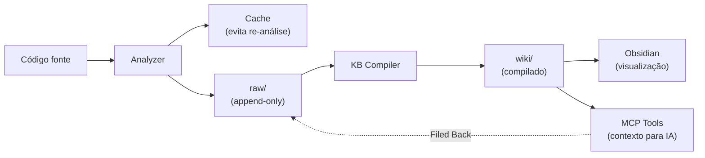

# 💡 IDEIA 3 — Análise, Resumo e Armazenamento Otimizado

## Conceito

O sistema deve analisar código-fonte e gerar **dois tipos de output**:

1. **Para IA**: Resumo 100% otimizado para consumo por IA (inglês, prompt negativo, structured data)
2. **Para Humano**: Documentação técnica em Markdown (PT-BR, diagramas, escrita técnica)

O armazenamento opera em 3 camadas: **cache** (temporário), **raw/** (permanente, append-only para KB), e **wiki/** (compilado pelo Knowledge Base).

> **Integração KB (Ideia 6)**: Todas as análises alimentam o Knowledge Base via `raw/`. O KB Compiler transforma dados brutos em wiki compilada. Soluções boas da IA potente voltam via **Filed Back loop**.

## Filosofia de Análise

### Output para IA — Princípios
- **Idioma**: Sempre em inglês (melhor tokenização, treinamento)
- **Prompt negativo**: Incluir o que a IA NÃO deve fazer
- **Structured**: Seções claras e padronizadas
- **Minimal**: Só o que é relevante, sem boilerplate
- **Annotated**: Código com comentários inline sobre pontos críticos

### Output para Humano — Princípios
- **Idioma**: PT-BR técnico
- **Formato**: Markdown com frontmatter YAML
- **Visual**: Diagramas Mermaid, tabelas, callouts
- **Padrão**: Segue ADR (Architecture Decision Records) e C4 Model
- **Obsidian-compatible**: Wikilinks, tags, metadata

## Passos Técnicos

### Passo 1: Criar Analyzer Engine
```python
# src/core/analyzer.py
class CodeAnalyzer:
    def __init__(self, provider: AIProvider):
        self.provider = provider
    
    async def analyze_file(self, filepath: str) -> AnalysisResult:
        """Analisa um arquivo e retorna resultado estruturado."""
        content = read_file(filepath)
        dependencies = extract_dependencies(filepath)
        language = detect_language(filepath)
        
        # Análise pela IA base
        analysis = await self.provider.complete(
            prompt=self._build_analysis_prompt(content, dependencies),
            system="You are a code analysis engine. Be concise and structured."
        )
        
        return AnalysisResult(
            filepath=filepath,
            language=language,
            dependencies=dependencies,
            summary_for_ai=analysis.ai_summary,       # EN
            summary_for_human=analysis.human_summary,  # PT-BR
            difficulty_estimate=analysis.difficulty,
            key_patterns=analysis.patterns
        )
```

### Passo 2: Criar Summarizer com Dual Output
```python
# src/core/summarizer.py
class ContextSummarizer:
    SYSTEM_PROMPT_AI = """You are a context preparation engine.
    Generate ONLY structured summaries optimized for AI consumption.
    Rules:
    - English only
    - No explanations of basic concepts
    - Include negative prompts
    - Focus on: architecture, dependencies, error patterns
    - Use structured headers (####)
    - Annotate critical code sections
    """
    
    SYSTEM_PROMPT_HUMAN = """Você é um documentador técnico.
    Gere resumos técnicos em PT-BR para desenvolvedores.
    Rules:
    - Português técnico
    - Use diagramas Mermaid quando aplicável
    - Siga padrões ADR
    - Inclua: Contexto, Análise, Impacto, Recomendações
    - Frontmatter YAML com tags e metadados
    """
    
    async def summarize_for_ai(self, analysis: AnalysisResult) -> str:
        """Gera resumo otimizado para IA potente."""
        return await self.provider.complete(
            prompt=self._format_for_ai(analysis),
            system=self.SYSTEM_PROMPT_AI
        )
    
    async def summarize_for_human(self, analysis: AnalysisResult) -> str:
        """Gera resumo técnico para o desenvolvedor."""
        return await self.provider.complete(
            prompt=self._format_for_human(analysis),
            system=self.SYSTEM_PROMPT_HUMAN
        )
```

### Passo 3: Implementar Storage Layer (3 camadas)
```python
# src/storage/markdown_store.py
class MarkdownStore:
    def __init__(self, base_path: str):
        self.base_path = Path(base_path)
        self.cache_path = self.base_path / ".danger_line" / "cache"
        self.raw_path = self.base_path / ".danger_line" / "raw"     # KB raw
        self.wiki_path = self.base_path / ".danger_line" / "wiki"   # KB compiled
    
    def save_analysis(self, result: AnalysisResult):
        """Salva análise no cache E no raw/ para o KB."""
        # 1. Cache (para evitar re-análise)
        cache_file = self.cache_path / f"{result.file_hash}.json"
        cache_file.write_text(result.to_json(), encoding="utf-8")
        
        # 2. Raw (append-only, alimenta o KB Compiler)
        raw_file = self.raw_path / "analyses" / f"{date.today()}_{result.filename}.md"
        raw_file.parent.mkdir(parents=True, exist_ok=True)
        raw_file.write_text(self._format_raw(result), encoding="utf-8")
    
    def save_solution(self, solution: SolutionResult):
        """Salva solução no raw/ para Filed Back loop."""
        raw_file = self.raw_path / "solutions" / f"{date.today()}_{solution.filename}.md"
        raw_file.parent.mkdir(parents=True, exist_ok=True)
        raw_file.write_text(self._format_raw_solution(solution), encoding="utf-8")
```

### Passo 4: Integração com Obsidian (Obrigatório)
```python
# src/storage/obsidian.py
class ObsidianIntegration:
    """Obsidian é a IDE de visualização do Knowledge Base."""
    def __init__(self, vault_path: str):
        self.vault_path = Path(vault_path)
        self.projects_folder = self.vault_path / "projects"
    
    def sync_wiki_to_vault(self, project_name: str, wiki_path: str):
        """Sincroniza wiki compilada com o vault do Obsidian."""
        dest = self.projects_folder / project_name / "wiki"
        shutil.copytree(wiki_path, dest, dirs_exist_ok=True)
    
    def save_project_card(self, project_name: str, card_content: str):
        """Salva Project Card no vault."""
        card_path = self.projects_folder / project_name / "project_card.md"
        card_path.parent.mkdir(parents=True, exist_ok=True)
        card_path.write_text(card_content, encoding="utf-8")
```

### Passo 5: Filed Back Loop
```python
# src/core/knowledge/feedback.py
class FeedbackLoop:
    """Soluções de qualidade voltam para o raw/ → wiki."""
    def file_back(self, solution: SolutionResult, store: MarkdownStore):
        """Salva solução no raw/ para ser compilada no wiki."""
        store.save_solution(solution)
        # Trigger compilação incremental
        self.compiler.compile_incremental(solution)
```

### Passo 5: Cache Inteligente
```python
# src/storage/cache.py
class AnalysisCache:
    def __init__(self, cache_dir: str):
        self.cache_dir = Path(cache_dir)
        self.index_file = self.cache_dir / "index.json"
    
    def is_stale(self, filepath: str) -> bool:
        """Verifica se a análise está desatualizada (arquivo modificado)."""
        cached = self._get_cached(filepath)
        if not cached:
            return True
        
        current_mtime = os.path.getmtime(filepath)
        return current_mtime > cached["mtime"]
    
    def get_or_analyze(self, filepath: str, analyzer) -> AnalysisResult:
        """Retorna do cache ou analisa novamente se necessário."""
        if not self.is_stale(filepath):
            return self._load_cached(filepath)
        
        result = analyzer.analyze_file(filepath)
        self._save_to_cache(filepath, result)
        return result
```

---

## Pipeline Completo: Análise → Cache → Raw → Wiki → Obsidian



> **Decisão**: Obsidian é **obrigatório** como IDE de visualização do KB. Wikilinks `[[estilo Obsidian]]` são o formato padrão de links internos.
