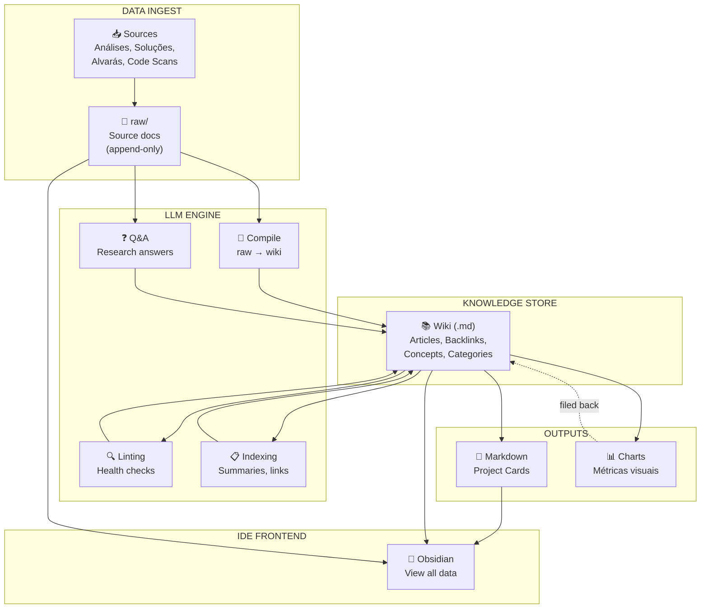
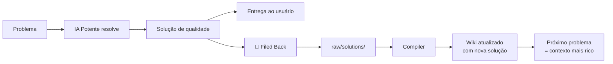

# 💡 IDEIA 6 — Knowledge Base Pessoal (Método Karpathy)

> **Status**: ✅ Conceito validado — Integração definida

---

## O Método Karpathy — Estudo

### O que é?

Andrej Karpathy popularizou um método de gestão de conhecimento pessoal onde uma **IA mantém uma wiki estruturada** a partir de dados brutos. A analogia central é:

| Conceito de Software | Equivalente no KB |
|----------------------|-------------------|
| **Código-fonte** | Dados brutos (análises, código, soluções) |
| **Compilador** | LLM que processa e organiza |
| **Binário executável** | Wiki compilada — conhecimento estruturado e interligado |
| **IDE** | Obsidian (visualização e navegação) |

### Princípios Fundamentais

1. **Compilar, não pesquisar**: A IA "compila" o conhecimento em artigos permanentes e interligados
2. **Append-only raw**: Dados brutos nunca são editados; são a "fonte da verdade"
3. **Wiki viva**: A wiki é constantemente atualizada, refinada e interligada pela IA
4. **Sem vector DB**: Para escala pessoal, Markdown + context window do LLM é suficiente
5. **Plain files**: Tudo em Markdown, portável, legível por humanos, future-proof
6. **IA como bibliotecário**: A IA cuida da organização; o humano cuida da curadoria de inputs

---

## Arquitetura do KB (Baseada no Diagrama Karpathy)

### LLM Engine — 4 Motores



### Os 4 Motores do LLM Engine

| Motor | Função | Tarefa Danger Line | Quando Roda |
|-------|--------|-------------------|-------------|
| **Compile** | raw → wiki | Transforma análises brutas em artigos estruturados | A cada nova análise (incremental) |
| **Q&A** | Research answers | Responde perguntas sobre o wiki compilado | Sob demanda via MCP |
| **Linting** | Health checks | Encontra inconsistências, dados faltando, sugere conexões | Periódico (batch) ou sob demanda |
| **Indexing** | Summaries + links | Mantém index.md, auto-gera [[wikilinks]], categoriza | Após cada compilação |

### Linting — O Motor que Faltava

O Linting é a peça mais impactante que não tínhamos. Ele:

- **Encontra inconsistências**: "O wiki diz que auth usa bcrypt, mas o código usa argon2"
- **Imputa dados faltando**: "O módulo X não tem artigo no wiki, sugiro criar"
- **Sugere conexões**: "O pattern em auth.py é similar ao de users.py — linkar?"
- **Detecta artigos stale**: "Este artigo não foi atualizado há 30 dias e o código mudou"

```python
# src/core/knowledge/linter.py
class WikiLinter:
    LINT_PROMPT = """You are a knowledge base health checker.
    Analyze the wiki articles and report:
    1. INCONSISTENCIES: conflicting information between articles
    2. MISSING: topics that should exist but don't
    3. STALE: articles that may be outdated
    4. CONNECTIONS: potential links between unrelated articles
    
    RESPOND JSON: {"issues": [...], "suggestions": [...]}"""
    
    async def lint(self, wiki_path: str) -> LintReport:
        articles = self._load_all_articles(wiki_path)
        report = await self.provider.complete(
            prompt=f"WIKI ARTICLES:\n{self._format_articles(articles)}",
            system=self.LINT_PROMPT
        )
        return LintReport(**json.loads(report))
```

### Q&A Engine — Consulta ao Wiki

```python
# src/core/knowledge/qa_engine.py
class WikiQA:
    QA_PROMPT = """You are a knowledge base query engine.
    Answer the question using ONLY information from the wiki articles provided.
    If the answer is not in the wiki, say "NOT_FOUND".
    Always cite the source article with [[wikilinks]]."""
    
    async def query(self, question: str, wiki_path: str) -> QAResult:
        relevant = self.indexer.search(question)  # busca por relevância
        answer = await self.provider.complete(
            prompt=f"QUESTION: {question}\n\nRELEVANT ARTICLES:\n{relevant}",
            system=self.QA_PROMPT
        )
        return QAResult(answer=answer, sources=self._extract_sources(answer))
```

### Filed Back Loop — Compounding

O conceito mais importante: **outputs bons voltam para o wiki**.



Isso significa que o wiki **compound** — cada problema resolvido torna o sistema mais inteligente para o próximo.

---

## Estrutura de Pastas (Definitiva)

```
DangerLine_KB/                     # Vault global no Obsidian
├── projects/                      # Subpastas por projeto
│   ├── MeuProjeto/
│   │   ├── raw/                   # Append-only
│   │   │   ├── analyses/          # Análises brutas
│   │   │   ├── classifications/   # Classificações
│   │   │   ├── solutions/         # Soluções (base + potente)
│   │   │   └── reviews/           # Alvarás
│   │   ├── wiki/                  # Wiki compilada
│   │   │   ├── architecture/      # Decisões e padrões
│   │   │   ├── patterns/          # Patterns detectados
│   │   │   ├── bugs/              # Bugs conhecidos
│   │   │   ├── dependencies/      # Mapa de deps vivo
│   │   │   ├── index.md           # Índice mestre
│   │   │   └── changelog.md       # Log de mudanças
│   │   └── project_card.md        # 🆕 Project Card (para humano)
│   └── OutroProjeto/
│       └── ...
├── global/                        # Conhecimento cross-project
│   ├── patterns/                  # Patterns comuns entre projetos
│   ├── lessons/                   # Lições aprendidas
│   └── index.md
├── output/                        # Outputs derivados
│   ├── charts/                    # Gráficos gerados
│   └── reports/                   # Relatórios semanais
└── AGENT.md                       # Instruções para o agente
```

---

## Project Card — Auto-gerado

Quando um projeto novo é registrado, o sistema gera automaticamente:

```markdown
---
title: "Project Card: MeuProjeto"
created: 2026-05-04T18:30:00
last_updated: 2026-05-04T20:00:00
language: python
framework: fastapi
knowledge_score: 35%
tags: [project-card, python, fastapi]
---

# 📋 MeuProjeto

## Resumo
API REST em FastAPI para gestão de usuários...

## Stack
- Python 3.11 + FastAPI + SQLAlchemy
- PostgreSQL, Redis, Docker

## 🔧 Especificações Técnicas
- Arquitetura: Clean Architecture (3 camadas)
- Auth: JWT + bcrypt
- 15 endpoints, 8 modelos

## 🐛 Bugs Conhecidos
- [[Race Condition - Token Refresh]] (resolvido)
- [[Missing Validation on /users]] (em aberto)

## 📊 Métricas KB
- Artigos no wiki: 12
- Cobertura: 35% dos módulos documentados
- Último lint: 2026-05-04
- Problemas detectados: 2 inconsistências

## 🔗 Dependências Críticas
- [[express-jwt]] → vulnerabilidade conhecida em v3.x
- [[bcrypt]] → OK
```

---

## Tools MCP (Atualizadas com KB)

| Tool | Descrição | Motor KB |
|------|-----------|----------|
| `analyze_file` | Analisa arquivo + salva em raw/ | — |
| `classify_problem` | Classifica ★ consultando wiki/ | Q&A |
| `get_optimized_context` | Gera super-prompt com contexto do wiki | Q&A |
| `get_metrics` | Métricas de tokens + wiki stats | — |
| `compile_knowledge` | Processa raw/ e atualiza wiki/ | Compile |
| `query_knowledge` | Busca no wiki compilado | Q&A |
| `lint_wiki` | Health check do wiki | Linting |
| `get_project_card` | Retorna/gera Project Card | Compile |
| `get_known_patterns` | Lista patterns do projeto | Indexing |
| `get_known_bugs` | Lista bugs e soluções | Indexing |

---

## Impacto nas Ideias Existentes

### Ideia 3 (Análise/Resumo) → 🔴 Refatorar
- **Antes**: Análises salvas em cache simples
- **Depois**: Análises vão para `raw/`, compiladas em `wiki/` via Compiler
- O cache continua para evitar re-análise, mas o **resultado** alimenta o KB
- **Filed Back**: Soluções da IA potente voltam para raw/ → wiki/
- Obsidian agora é **obrigatório** (não mais "alternativa")

### Ideia 4 (Classificação ★) → 🟡 Aprimorar
- **Antes**: Classificação baseada só no problema atual
- **Depois**: Classifier consulta `wiki/bugs/` via Q&A Engine — "Já vimos algo assim?"
- Se o KB tem solução para um pattern similar, pode **reclassificar de 3★ para 1★**
- Linting pode detectar classificações incorretas retroativamente

### Ideia 5 (Painel) → 🟡 Expandir
- **Novas métricas**:
  - "Knowledge Score" por projeto — % documentado no wiki
  - "KB Hits" — quantas vezes o wiki evitou análise completa
  - "Wiki Health" — resultado do último lint
  - Total de artigos, palavras, backlinks
- Charts gerados e **filed back** para o wiki

### Arquitetura do Core → 🔴 Expandir
```
src/core/knowledge/
├── compiler.py     # raw → wiki (Compile)
├── qa_engine.py    # Q&A sobre o wiki
├── linter.py       # Health checks
├── indexer.py      # Auto-linking + summaries
├── linker.py       # Cross-references [[wikilinks]]
└── feedback.py     # Filed Back loop
```

---

## Riscos e Mitigações

| Risco | Mitigação |
|-------|-----------|
| Wiki desatualizado | Linting periódico + detecção de mudanças no código |
| Custo de compilação | Usar IA base (Groq) para compilar, não a potente |
| Qualidade dos artigos | Alvará da IA potente inclui revisão do wiki |
| Wiki muito grande para context window | Indexer seleciona apenas artigos relevantes |
| Complexidade adicional | Implementar incremental: cache → raw → wiki |
