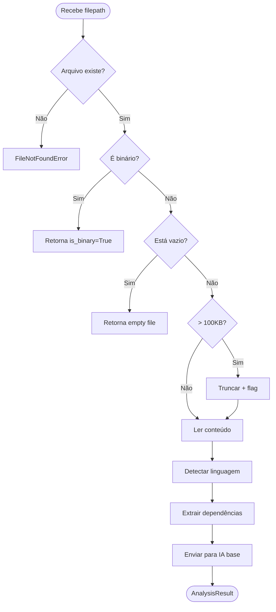

# 🧪 TDD-01: Análise de Arquivo

## Caso de Uso
O sistema recebe um caminho de arquivo e retorna uma análise estruturada com resumo, dependências e classificação de linguagem.

## Pré-condições
- Workspace configurado
- Arquivo existe no filesystem
- Pelo menos um provider de IA disponível

## Testes

### T-01.1: Análise de arquivo Python válido
- **Input**: Caminho para um `.py` com imports e funções
- **Expected**: AnalysisResult com language="python", dependências extraídas, resumo gerado
- **Validação**: `result.language == "python"`, `len(result.dependencies) > 0`, `result.summary_for_ai != ""`

### T-01.2: Análise de arquivo JavaScript válido
- **Input**: Caminho para um `.js` com imports ES6
- **Expected**: AnalysisResult com language="javascript"
- **Validação**: Dependências extraídas corretamente de `import ... from`

### T-01.3: Arquivo não encontrado
- **Input**: Caminho inexistente
- **Expected**: FileNotFoundError com mensagem descritiva
- **Validação**: Exception raised, mensagem contém o path

### T-01.4: Arquivo binário (imagem, .exe)
- **Input**: Caminho para arquivo binário
- **Expected**: AnalysisResult com flag `is_binary=True`, sem análise de código
- **Validação**: `result.is_binary == True`, `result.summary == "Binary file, skipped"`

### T-01.5: Arquivo vazio
- **Input**: Arquivo `.py` com 0 bytes
- **Expected**: AnalysisResult com resumo indicando arquivo vazio
- **Validação**: `result.summary_for_ai` contém "empty file"

### T-01.6: Arquivo muito grande (>100KB)
- **Input**: Arquivo com >100KB de código
- **Expected**: Análise parcial (primeiras N linhas) com flag `truncated=True`
- **Validação**: `result.truncated == True`

## Diagrama de Fluxo

