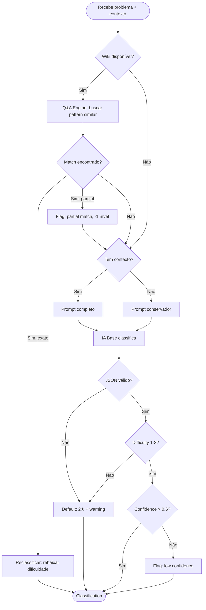

# 🧪 TDD-02: Classificação por Estrelas (com Knowledge Base)

## Caso de Uso
O sistema recebe a descrição de um problema e contexto de código, **consulta o wiki do KB** e retorna uma classificação de dificuldade (1-3★). Se o KB contém solução para um pattern similar, a classificação é rebaixada.

## Pré-condições
- Provider de IA disponível
- Contexto de código já analisado (opcional)
- Wiki do Knowledge Base acessível (opcional, mas melhora precisão)

## Testes

### T-02.1: Classificar erro de sintaxe como 1★
- **Input**: `"SyntaxError: unexpected EOF while parsing"` + código com parenthesis faltando
- **Expected**: `Classification(difficulty=1, category="syntax")`
- **Validação**: `result.difficulty == 1`

### T-02.2: Classificar bug de lógica como 2★
- **Input**: `"Function returns None instead of expected value"` + código com lógica errada
- **Expected**: `Classification(difficulty=2, category="logic")`
- **Validação**: `result.difficulty == 2`

### T-02.3: Classificar problema de arquitetura como 3★
- **Input**: `"Need to refactor monolith into microservices"` + múltiplos arquivos
- **Expected**: `Classification(difficulty=3, category="architecture")`
- **Validação**: `result.difficulty == 3`

### T-02.4: Classificação com confidence alta
- **Input**: Problema claramente simples (import faltando)
- **Expected**: `confidence >= 0.8`
- **Validação**: `result.confidence >= 0.8`

### T-02.5: Classificação com confidence baixa
- **Input**: Problema ambíguo (poderia ser 2★ ou 3★)
- **Expected**: `confidence < 0.6`
- **Validação**: `result.confidence < 0.6`, sistema pede input do usuário

### T-02.6: Classificação sem contexto de código
- **Input**: Apenas descrição textual do problema
- **Expected**: Classificação conservadora (tende a 2★)
- **Validação**: `result.difficulty >= 2` (sem contexto, ser conservador)

### T-02.7: Resposta inválida da IA
- **Input**: IA retorna JSON malformado
- **Expected**: Default para 2★ + log de warning
- **Validação**: `result.difficulty == 2`, warning emitido

### T-02.8: Reclassificação via Wiki (KB) — 3★ → 1★
- **Input**: Problema classificado como 3★, mas wiki tem `[[Race Condition - Token Refresh]]` com solução
- **Wiki Context**: `"Similar bug solved: mutex pattern. See [[Race Condition - Token Refresh]]"`
- **Expected**: `Classification(difficulty=1, wiki_match="Race Condition - Token Refresh")`
- **Validação**: `result.difficulty == 1`, `result.wiki_match is not None`

### T-02.9: Classificação com wiki vazio
- **Input**: Problema + wiki sem artigos relevantes
- **Wiki Context**: `"NOT_FOUND"`
- **Expected**: Classificação normal sem downgrade
- **Validação**: Classificação idêntica ao fluxo sem wiki

### T-02.10: Wiki match com confidence parcial
- **Input**: Problema similar (mas não idêntico) a um bug conhecido
- **Wiki Context**: `"Partially related: [[Auth Middleware Pattern]] (similarity: 0.6)"`
- **Expected**: Downgrade de 1 nível (3★ → 2★) com flag
- **Validação**: `result.difficulty` rebaixado em 1, flag `partial_match=True`

## Diagrama de Fluxo

