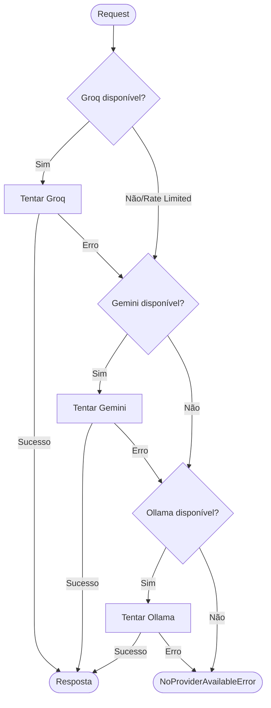

# 🧪 TDD-03: Provider Chain (Fallback de IAs)

## Caso de Uso
O sistema tenta usar o provider principal (Groq). Se indisponível, faz fallback para Gemini Flash, depois Ollama.

## Pré-condições
- Pelo menos um provider configurado no `.env`

## Testes

### T-03.1: Groq disponível — usa Groq
- **Setup**: Groq API key válida, servidor acessível
- **Expected**: Resposta vem do Groq
- **Validação**: `result.provider == "groq"`, response não vazio

### T-03.2: Groq indisponível — fallback para Gemini
- **Setup**: Groq retorna 429 (rate limit), Gemini disponível
- **Expected**: Resposta vem do Gemini Flash
- **Validação**: `result.provider == "gemini"`, retry count = 1

### T-03.3: Groq e Gemini indisponíveis — fallback para Ollama
- **Setup**: Groq 429, Gemini 503, Ollama rodando
- **Expected**: Resposta vem do Ollama
- **Validação**: `result.provider == "ollama"`

### T-03.4: Nenhum provider disponível
- **Setup**: Todos os providers offline
- **Expected**: `NoProviderAvailableError`
- **Validação**: Exception com lista de providers tentados

### T-03.5: Provider retorna erro mid-request
- **Setup**: Groq aceita request mas timeout na resposta
- **Expected**: Fallback transparente para próximo provider
- **Validação**: Sem crash, resposta obtida de fallback

### T-03.6: Rate limit tracking
- **Setup**: Groq retorna 429 com header `retry-after: 60`
- **Expected**: Provider marcado como indisponível por 60s, próximas requests vão direto para fallback
- **Validação**: Dentro de 60s, Groq não é tentado

## Diagrama de Fluxo

