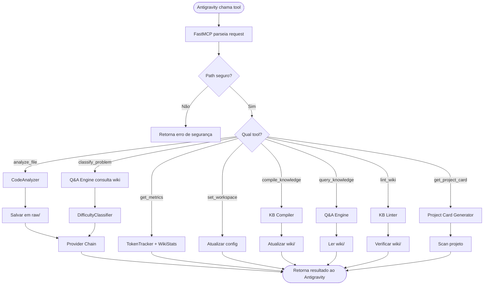

# 🧪 TDD-04: MCP Server (com Knowledge Base Tools)

## Caso de Uso
O sistema expõe tools via MCP para integração com Antigravity/Gemini CLI, incluindo tools de Knowledge Base.

## Pré-condições
- FastMCP instalado (`mcp[cli]`)
- Workspace configurado
- Obsidian vault path configurado

## Testes

### T-04.1: Server inicia sem erros
- **Setup**: Configuração válida no `.env`
- **Expected**: Server inicia e registra TODAS as tools (incluindo KB)
- **Validação**: Processo rodando, tools registradas >= 10

### T-04.2: Tool `analyze_file` retorna resultado e alimenta raw/
- **Input**: `analyze_file(path="src/main.py")`
- **Expected**: String com análise otimizada + arquivo criado em `raw/analyses/`
- **Validação**: Retorno não vazio, `raw/analyses/` contém novo arquivo

### T-04.3: Tool `classify_problem` consulta wiki antes de classificar
- **Input**: `classify_problem(description="SyntaxError in line 5")`
- **Expected**: JSON com difficulty, confidence, reasoning, wiki_match
- **Validação**: Campos obrigatórios presentes, `wiki_match` presente (mesmo que null)

### T-04.4: Tool `get_metrics` retorna métricas + wiki stats
- **Input**: `get_metrics()`
- **Expected**: String formatada com métricas de tokens E wiki stats
- **Validação**: Contém `tokens_saved`, `savings_percentage`, `wiki_articles`, `knowledge_score`

### T-04.5: Tool com path inválido
- **Input**: `analyze_file(path="../../etc/passwd")`
- **Expected**: Erro de segurança, path fora do workspace
- **Validação**: Error retornado, path não acessado

### T-04.6: Tool `set_workspace` troca workspace
- **Input**: `set_workspace(path="C:/valid/path")`
- **Expected**: Workspace atualizado
- **Validação**: Próxima chamada de `analyze_file` usa novo workspace

### T-04.7: Tool `compile_knowledge` processa raw/ → wiki/
- **Input**: `compile_knowledge()`
- **Pre-cond**: Existem arquivos em `raw/analyses/` não compilados
- **Expected**: Novos artigos criados em `wiki/`, index.md atualizado
- **Validação**: Contagem de artigos no wiki aumentou, index.md modificado

### T-04.8: Tool `query_knowledge` retorna resposta do wiki
- **Input**: `query_knowledge(query="authentication patterns")`
- **Pre-cond**: Wiki tem artigo `[[Authentication System]]`
- **Expected**: Resposta com conteúdo do artigo + source citation
- **Validação**: Resposta contém `[[Authentication System]]`, não é "NOT_FOUND"

### T-04.9: Tool `lint_wiki` detecta issues
- **Input**: `lint_wiki()`
- **Pre-cond**: Wiki tem artigos com inconsistência (auth diz bcrypt, código usa argon2)
- **Expected**: LintReport com issues encontradas
- **Validação**: `report.issues` não vazio, contém tipo "INCONSISTENCY"

### T-04.10: Tool `get_project_card` gera card para projeto novo
- **Input**: `get_project_card(project="MeuProjeto")`
- **Pre-cond**: Projeto existe no workspace mas não tem card
- **Expected**: Project Card gerado com resumo, stack, métricas
- **Validação**: Card contém seções obrigatórias (Resumo, Stack, Métricas)

## Diagrama de Fluxo

