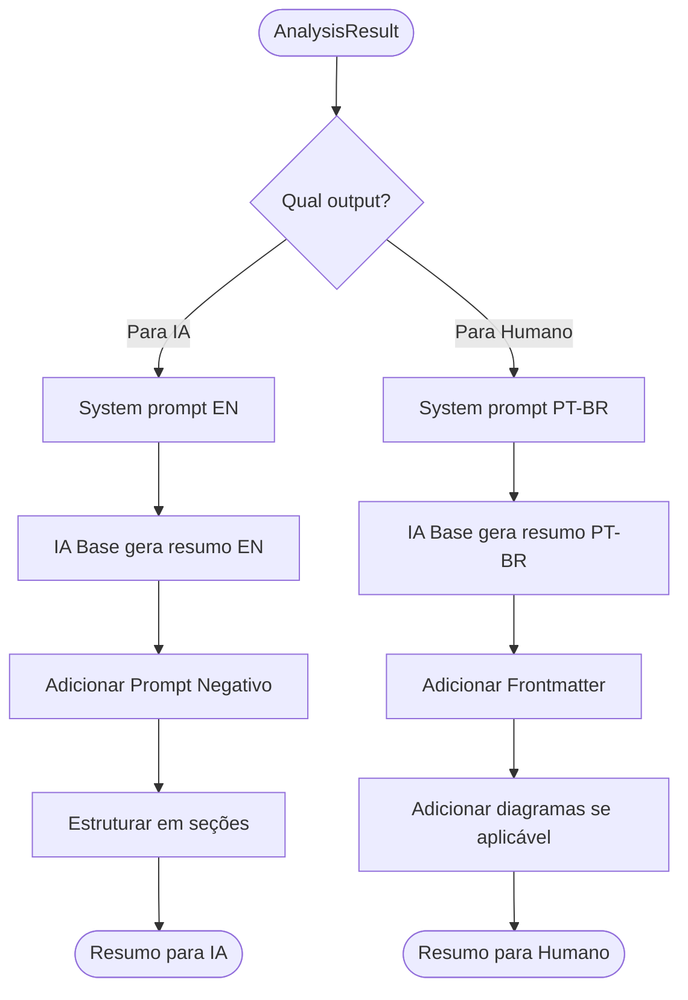

# 🧪 TDD-05: Geração de Resumos (Summarizer)

## Caso de Uso
O sistema gera dois tipos de resumo a partir de uma análise: otimizado para IA (EN) e técnico para humano (PT-BR).

## Pré-condições
- AnalysisResult disponível
- Provider de IA disponível

## Testes

### T-05.1: Resumo para IA em inglês
- **Input**: AnalysisResult de um arquivo Python
- **Expected**: Resumo em inglês, structured, com prompt negativo
- **Validação**: Texto em inglês, contém "NEGATIVE PROMPT", contém "####" headers

### T-05.2: Resumo para humano em PT-BR
- **Input**: AnalysisResult de um arquivo Python
- **Expected**: Markdown técnico em PT-BR com frontmatter
- **Validação**: Texto em português, contém `---` frontmatter, headers em PT

### T-05.3: Resumo inclui dependências
- **Input**: AnalysisResult com 5 dependências
- **Expected**: Dependências listadas em ambos resumos
- **Validação**: Todas as 5 deps presentes no output

### T-05.4: Resumo de arquivo grande (truncado)
- **Input**: AnalysisResult com `truncated=True`
- **Expected**: Resumo indica que código foi truncado
- **Validação**: Contém aviso de truncamento

### T-05.5: Resumo com prompt negativo adequado
- **Input**: Problema de sintaxe simples
- **Expected**: Prompt negativo instrui IA a não explicar conceitos básicos
- **Validação**: Contém "Do NOT explain basic concepts"

## Diagrama de Fluxo

