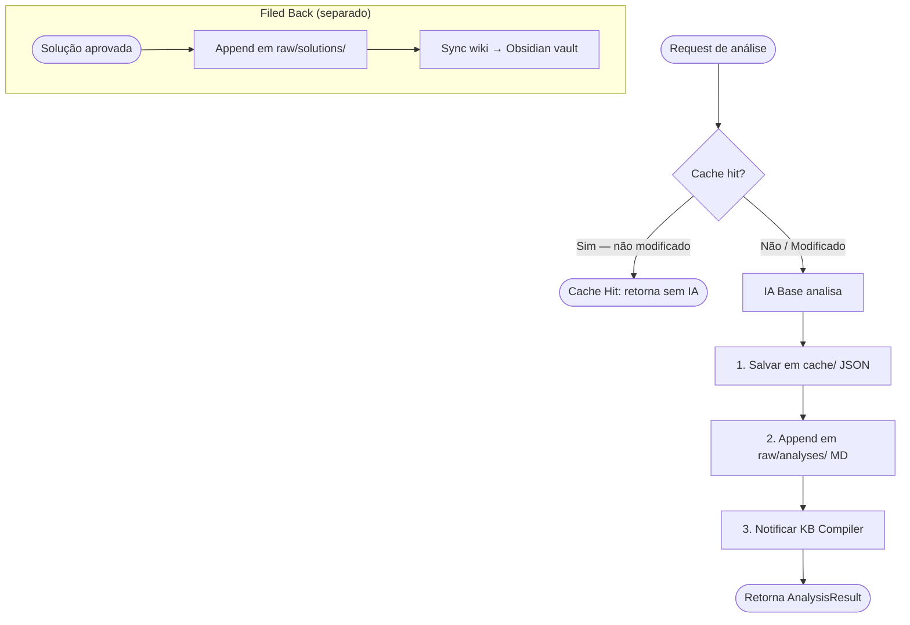

# 🧪 TDD-06: Armazenamento e Cache (3 Camadas)

## Caso de Uso
O sistema gerencia armazenamento em **3 camadas**: cache (evitar re-análise), raw/ (append-only para KB), e wiki/ (compilado). Cada análise percorre as camadas adequadas automaticamente.

## Pré-condições
- Workspace com permissão de escrita
- Estrutura `danger_line/` criável no projeto
- Obsidian vault path configurado (obrigatório)

## Testes

### T-06.1: Salvar análise no cache + raw/ (ambos simultaneamente)
- **Input**: `AnalysisResult` de `auth.py`
- **Expected**: Arquivo criado em `danger_line/cache/{hash}.json` E em `danger_line/raw/analyses/{date}_auth_py.md`
- **Validação**: Ambos os arquivos existem, cache é JSON, raw é Markdown com frontmatter

### T-06.2: Cache hit — arquivo não modificado
- **Input**: Segundo request para mesmo arquivo (não modificado)
- **Expected**: Retorna do cache, IA não chamada, raw/ NÃO recebe novo arquivo
- **Validação**: `cache_hit == True`, nenhum novo arquivo em raw/

### T-06.3: Cache miss — arquivo modificado (mtime mudou)
- **Input**: Arquivo modificado após cache existente
- **Expected**: Nova análise, cache atualizado, raw/ recebe novo arquivo com timestamp
- **Validação**: `cache_hit == False`, novo mtime no cache, raw/ tem 2 arquivos do mesmo módulo

### T-06.4: Cache miss — arquivo novo
- **Input**: Arquivo não presente no cache
- **Expected**: Análise completa, cache criado, raw/ recebe arquivo
- **Validação**: Novo entry no cache, novo arquivo em raw/analyses/

### T-06.5: Salvar solução no raw/solutions/ (Filed Back)
- **Input**: `SolutionResult` aprovado pela IA premium
- **Expected**: Arquivo salvo em `danger_line/raw/solutions/{date}_{filename}.md`
- **Validação**: Arquivo existe com campos: problem, solution, source (base|premium)

### T-06.6: Salvar alvará no raw/reviews/
- **Input**: Batch review da IA premium com 5 itens
- **Expected**: Arquivo salvo em `danger_line/raw/reviews/{date}_batch_{n}.md`
- **Validação**: Arquivo existe, contém todos os 5 itens

### T-06.7: Sync wiki para Obsidian vault
- **Input**: Wiki compilado em `danger_line/wiki/`, vault configurado
- **Expected**: Arquivos copiados para `vault/projects/{project}/wiki/`
- **Validação**: Arquivos existem no vault, wikilinks preservados

### T-06.8: Obsidian vault com path inválido
- **Input**: `OBSIDIAN_VAULT_PATH` aponta para pasta que não existe
- **Expected**: Erro claro com instrução de como corrigir
- **Validação**: Exception com mensagem amigável, operação não silenciosa (vault é obrigatório)

### T-06.9: raw/ é append-only — nunca sobrescreve
- **Input**: Dois requests de análise do mesmo arquivo em datas diferentes
- **Expected**: raw/analyses/ tem DOIS arquivos (com datas diferentes), não um sobrescrito
- **Validação**: Contagem de arquivos em raw/analyses/ cresce, nunca diminui

### T-06.10: Falha de escrita — disco cheio simulado
- **Input**: Mock de `IOError` ao tentar salvar
- **Expected**: Erro propagado, operação em raw/ e cache não corrompida (atomicidade)
- **Validação**: Nenhum arquivo parcialmente escrito

## Diagrama de Fluxo

