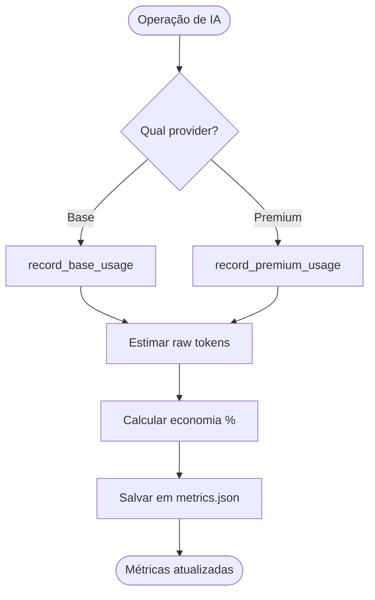

# 🧪 TDD-07: Token Tracker e Métricas

## Caso de Uso
O sistema rastreia tokens consumidos em cada provider, calcula economia e persiste métricas.

## Pré-condições
- TokenTracker inicializado
- Diretório de persistência acessível

## Testes

### T-07.1: Registrar uso de tokens da IA base
- **Input**: `record_base_usage(input=500, output=200)`
- **Expected**: `total_base == 700`
- **Validação**: Métricas incrementadas corretamente

### T-07.2: Registrar uso de tokens da IA potente
- **Input**: `record_premium_usage(input=1000, output=500)`
- **Expected**: `total_premium == 1500`
- **Validação**: Métricas incrementadas

### T-07.3: Calcular economia
- **Input**: `estimated_raw=5000, total_premium=2000`
- **Expected**: `tokens_saved=3000, savings_percentage=60%`
- **Validação**: Cálculo correto

### T-07.4: Persistência em JSON
- **Input**: Registrar métricas, recriar TokenTracker
- **Expected**: Métricas carregadas do arquivo JSON
- **Validação**: Valores persistidos == valores originais

### T-07.5: Registrar classificação por estrela
- **Input**: `record_classification(stars=2)` 3x, `record_classification(stars=1)` 5x
- **Expected**: `problems_by_star = {1: 5, 2: 3, 3: 0}`
- **Validação**: Contadores corretos

### T-07.6: Economia com zero tokens estimados
- **Input**: `estimated_raw=0`
- **Expected**: `savings_percentage=0.0` (sem divisão por zero)
- **Validação**: Sem exception, retorna 0

## Diagrama de Fluxo

