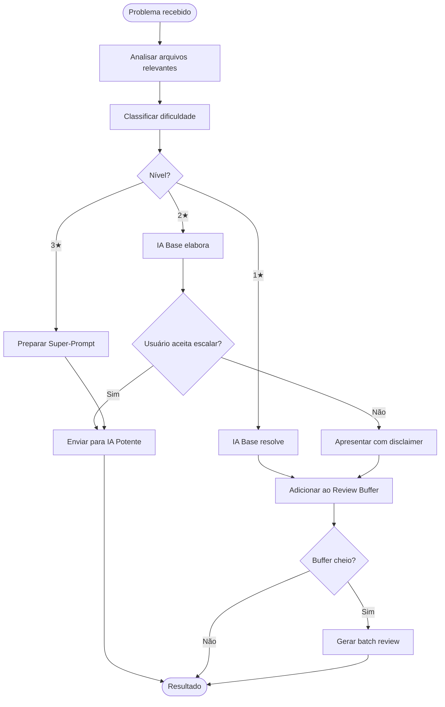

# 🧪 TDD-08: Orquestrador (Agent)

## Caso de Uso
O orquestrador recebe um problema, coordena análise, classificação e delegação para o provider correto.

## Pré-condições
- Providers configurados
- Classifier funcional

## Testes

### T-08.1: Problema 1★ — resolve localmente
- **Input**: "Fix missing import in main.py"
- **Expected**: IA base resolve, resultado vai para review buffer
- **Validação**: `result.stars == 1`, `result.source == "base_ai"`, buffer.length += 1

### T-08.2: Problema 2★ — pede consentimento
- **Input**: "Fix button onClick handler logic"
- **Expected**: Solução elaborada + flag `requires_consent=True`
- **Validação**: `result.stars == 2`, `result.requires_consent == True`, contexto otimizado pronto

### T-08.3: Problema 3★ — escala direto
- **Input**: "Refactor auth system to use JWT + refresh tokens"
- **Expected**: Super-prompt gerado, marcado para IA potente
- **Validação**: `result.stars == 3`, `result.source == "needs_premium_ai"`, super_prompt não vazio

### T-08.4: Escalação após consentimento (2★ → premium)
- **Input**: Usuário aceita escalar problema 2★
- **Expected**: Contexto otimizado enviado para IA potente
- **Validação**: `result.source == "premium_ai"`

### T-08.5: Recusa de escalação (2★ → base)
- **Input**: Usuário recusa escalar
- **Expected**: Solução da IA base apresentada com disclaimer
- **Validação**: `result.source == "base_ai"`, disclaimer presente

### T-08.6: Review buffer batch
- **Input**: 5 problemas 1★ acumulados
- **Expected**: Batch prompt gerado para IA potente
- **Validação**: Prompt contém 5 itens, formato correto

## Diagrama de Fluxo

