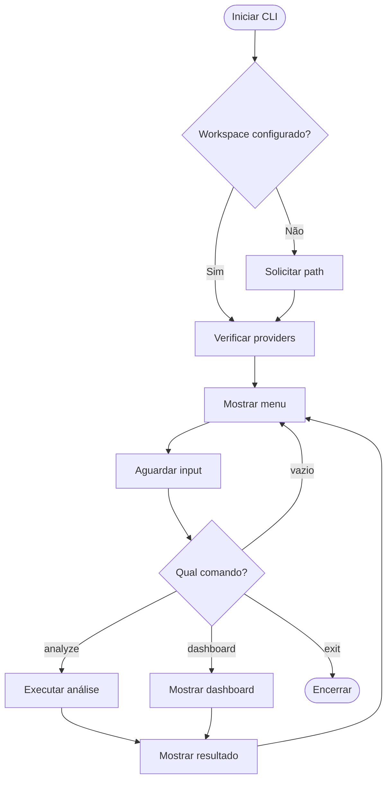

# 🧪 TDD-09: CLI Interface e Dashboard

## Caso de Uso
O terminal apresenta interface interativa com menu, comandos e painel de métricas.

## Pré-condições
- Terminal com suporte a Rich (cores, tabelas)
- Sistema inicializado

## Testes

### T-09.1: Menu principal renderiza
- **Input**: Iniciar CLI
- **Expected**: Menu com opções visíveis
- **Validação**: Output contém opções de menu

### T-09.2: Comando de análise de arquivo
- **Input**: Usuário digita comando de análise + path
- **Expected**: Análise executada, resultado mostrado
- **Validação**: Output contém resumo

### T-09.3: Dashboard renderiza métricas
- **Input**: Comando `dashboard` ou `metrics`
- **Expected**: Painel com barras de progresso, tabelas
- **Validação**: Output contém "ECONOMIA", percentagem, distribuição

### T-09.4: Comando de saída
- **Input**: Usuário digita "exit" ou "sair"
- **Expected**: Programa encerra gracefully
- **Validação**: Sem exceptions, métricas salvas

### T-09.5: Input vazio
- **Input**: Usuário pressiona Enter sem digitar
- **Expected**: Ignora, mostra prompt novamente
- **Validação**: Loop continua sem erro

### T-09.6: Workspace não configurado
- **Input**: Iniciar CLI sem WORKSPACE_PATH
- **Expected**: Solicita path ao usuário
- **Validação**: Prompt de configuração aparece

## Diagrama de Fluxo

