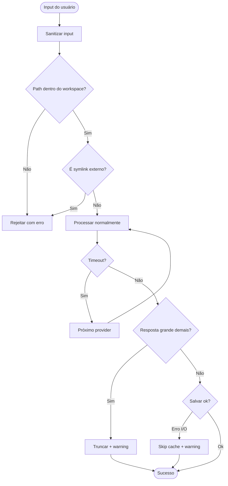

# 🧪 TDD-10: Segurança e Edge Cases

## Caso de Uso
O sistema deve ser seguro contra path traversal, injection e falhas de rede.

## Pré-condições
- Sistema funcional

## Testes

### T-10.1: Path traversal — tentativa de acessar fora do workspace
- **Input**: `analyze_file("../../etc/passwd")`
- **Expected**: Rejeição com erro de segurança
- **Validação**: Arquivo não acessado, erro retornado

### T-10.2: Path traversal — symlink para fora do workspace
- **Input**: Symlink apontando para fora do workspace
- **Expected**: Rejeição
- **Validação**: Symlink não seguido

### T-10.3: Prompt injection via nome de arquivo
- **Input**: Arquivo nomeado `"; rm -rf / #.py`
- **Expected**: Nome sanitizado, sem execução de comando
- **Validação**: Sem side effects

### T-10.4: Timeout de provider
- **Input**: Provider demora >30s para responder
- **Expected**: Timeout, fallback para próximo provider
- **Validação**: `TimeoutError` handled, fallback ativado

### T-10.5: Resposta muito grande da IA
- **Input**: IA retorna >50KB de texto
- **Expected**: Resposta truncada com warning
- **Validação**: Output limitado, warning logado

### T-10.6: Caracteres especiais em paths (Windows)
- **Input**: Path com acentos, espaços: `"Área de Trabalho/código.py"`
- **Expected**: Arquivo lido corretamente
- **Validação**: Encoding UTF-8 tratado

### T-10.7: Disco cheio ao salvar cache
- **Input**: Tentativa de salvar com disco cheio
- **Expected**: Erro graceful, operação continua sem cache
- **Validação**: `IOError` handled, warning emitido

## Diagrama de Fluxo

