# 🧪 TDD-12: KB Linter (Wiki Health Checks)

## Caso de Uso
O KB Linter verifica a saúde do wiki compilado em **dois modos**: automático (a cada N compilações, checks rápidos) e hot-update manual (full lint via MCP tool). Em ambos os modos, NÃO modifica nenhum arquivo — apenas reporta.

## Pré-condições
- Provider de IA disponível
- Wiki existe e contém pelo menos 3 artigos
- Acesso ao código-fonte do projeto (para detectar stale articles)
- `lint_interval` configurado no `AGENT.md` do projeto (default: 10 compilações)

## Testes

### T-12.1: Detectar inconsistência entre artigos
- **Input**: Wiki diz "auth usa bcrypt", código usa argon2
- **Expected**: `LintReport.issues` contém `{type: "INCONSISTENCY", article: "auth_system", detail: "..."}`
- **Validação**: Issue encontrada, tipo correto, referência ao artigo

### T-12.2: Detectar dados faltando (módulo sem artigo)
- **Input**: Projeto tem `src/payments/` mas wiki não tem artigo sobre payments
- **Expected**: `LintReport.suggestions` contém `{type: "MISSING", topic: "payments", action: "create_article"}`
- **Validação**: Sugestão gerada com path do módulo

### T-12.3: Detectar artigo stale (desatualizado)
- **Input**: Artigo `auth_system.md` com `last_compiled: 30 dias atrás`, código `auth.py` modificado ontem
- **Expected**: `LintReport.issues` contém `{type: "STALE", article: "auth_system", days_old: 30}`
- **Validação**: Issue identificada, delta de tempo correto

### T-12.4: Sugerir conexão entre artigos
- **Input**: Artigo A menciona "middleware pattern", Artigo B é sobre "Express Middleware" mas não há link
- **Expected**: `LintReport.suggestions` contém `{type: "CONNECTION", from: "A", to: "B"}`
- **Validação**: Sugestão gerada com artigos corretos

### T-12.5: Wiki saudável — sem issues
- **Input**: Wiki com artigos consistentes, atualizados e bem linkados
- **Expected**: `LintReport.issues == []`, `LintReport.health_score >= 0.9`
- **Validação**: Nenhuma issue, health score alto

### T-12.6: Wiki vazio — relatório especial
- **Input**: Wiki sem artigos
- **Expected**: Relatório com sugestão de compilação inicial
- **Validação**: `suggestions` contém `{type: "EMPTY_WIKI", action: "run_compile"}`

### T-12.7: Lint não modifica o wiki
- **Input**: Wiki com issues
- **Expected**: `lint_wiki()` APENAS reporta, não modifica nenhum arquivo
- **Validação**: Hashes dos arquivos do wiki inalterados antes e depois do lint

### T-12.8: Lint automático dispara após N compilações
- **Setup**: `lint_interval = 10` no AGENT.md, compile_count está em 9
- **Input**: `compile_incremental()` → compile_count chega a 10
- **Expected**: `lint_quick()` dispara automaticamente após a compilação
- **Escopo**: Apenas checks rápidos (STALE + MISSING), não INCONSISTENCY (caro)
- **Validação**: `lint_quick()` chamado, `lint_full()` NÃO chamado

### T-12.9: Hot-update manual via MCP tool — full lint
- **Input**: `lint_wiki()` chamado via MCP (sem trigger automático)
- **Expected**: `lint_full()` roda com TODOS os checks (INCONSISTENCY + STALE + MISSING + CONNECTION)
- **Validação**: Todos os 4 tipos de check executados, relatório completo retornado

## Diagrama de Fluxo

```mermaid
flowchart TD
    subgraph "Modo Automático (lint_quick)"
        AUTO([compile_incremental]) --> COUNT{compile_count % interval == 0?}
        COUNT -->|Não| SKIP[Pular lint]
        COUNT -->|Sim| QUICK[lint_quick: stale + missing apenas]
        QUICK --> QUICK_REPORT[LintReport parcial]
    end

    subgraph "Modo Manual (lint_full via MCP)"
        MCP_CALL([lint_wiki MCP tool]) --> LOAD[Carregar todos artigos do wiki]
        LOAD --> EMPTY{Wiki vazio?}
        EMPTY -->|Sim| REPORT_EMPTY[Relatório: wiki vazio]
        EMPTY -->|Não| CHECK
        CHECK --> CONSISTENCY[1. Verificar consistência]
        CONSISTENCY --> COVERAGE[2. Verificar cobertura]
        COVERAGE --> STALENESS[3. Verificar artigos stale]
        STALENESS --> LINKS[4. Sugerir conexões]
        CONSISTENCY --> ISSUES[Issues]
        COVERAGE --> SUGGESTIONS[Sugestões]
        STALENESS --> ISSUES
        LINKS --> SUGGESTIONS
        ISSUES --> REPORT[Gerar LintReport]
        SUGGESTIONS --> REPORT
        REPORT_EMPTY --> RESULT([Retorna LintReport])
        REPORT --> SCORE[Calcular health_score]
        SCORE --> RESULT
    end
```

