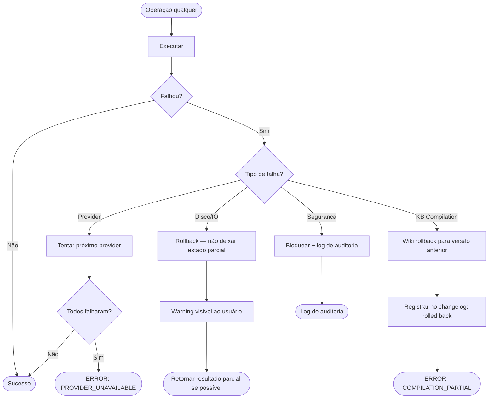

# 🧪 TDD-14: Recuperação de Falhas e Error Recovery

## Caso de Uso
O sistema deve lidar graciosamente com falhas em qualquer camada — providers, disco, compilação parcial — sem corromper o estado do Knowledge Base ou perder dados do cache.

## Pré-condições
- Ambiente de teste com mocks para simular falhas
- Wiki e cache em estado conhecido antes de cada teste

## Testes — Provider Failures

### T-14.1: Provider primário falha — fallback automático
- **Input**: Groq retorna HTTP 500
- **Expected**: Sistema tenta Gemini Flash automaticamente, sem intervenção do usuário
- **Validação**: Resposta válida recebida, log indica "Groq failed, using Gemini Flash"

### T-14.2: Todos os providers falham
- **Input**: Groq HTTP 500, Gemini HTTP 503, Ollama não está rodando
- **Expected**: Erro claro `ERROR: PROVIDER_UNAVAILABLE` + sugestão de diagnóstico
- **Validação**: Erro retornado, nenhum dado parcial salvo, estado do cache inalterado

### T-14.3: Rate limit do Groq (HTTP 429)
- **Input**: Groq retorna 429 com `retry-after: 30`
- **Expected**: Fallback imediato para Gemini (não aguarda 30s)
- **Validação**: Resposta via Gemini, tempo de espera < 2s

### T-14.4: Timeout de provider
- **Input**: Provider demora >30s para responder
- **Expected**: Timeout disparado, fallback para próximo provider
- **Validação**: Resposta em < 35s total, log de timeout

## Testes — Storage Failures

### T-14.5: Falha ao escrever no cache (disco cheio)
- **Input**: `IOError` simulado ao salvar cache
- **Expected**: Análise retornada ao usuário, warning de cache, raw/ NÃO escrito (atomicidade)
- **Validação**: Nenhum arquivo corrompido, usuário recebe resultado válido

### T-14.6: Falha ao escrever no raw/ (permissions)
- **Input**: `PermissionError` ao salvar em raw/
- **Expected**: Análise retornada, warning logged, KB Compiler NÃO notificado
- **Validação**: KB não corrompido, operação não silenciosa (warning visível)

### T-14.7: Obsidian vault inacessível durante sync
- **Input**: Vault path correto mas pasta temporariamente inacessível
- **Expected**: Sync agendada para próxima operação (retry queue), não falha fatal
- **Validação**: Operação não bloqueia, retry queue tem 1 item pendente

## Testes — KB Compilation Failures

### T-14.8: Compilação falha no meio (3 de 10 artigos)
- **Input**: Provider falha após compilar 3 artigos de 10
- **Expected**: Rollback automático — wiki volta ao estado anterior à compilação
- **Validação**: Wiki tem mesmos artigos de antes, changelog registra "compilation failed, rolled back"

### T-14.9: compile_count persiste entre sessões MCP
- **Input**: MCP server reiniciado após 7 compilações (faltam 3 para lint_quick)
- **Expected**: compile_count recuperado do `danger_line/config.toml` — não reinicia em 0
- **Validação**: Após 3 compilações pós-restart, lint_quick dispara corretamente

### T-14.10: Wiki corrompido (arquivo MD inválido)
- **Input**: Artigo do wiki com frontmatter YAML inválido
- **Expected**: Artigo inválido ignorado com warning, demais artigos funcionam normalmente
- **Validação**: Sistema continua operacional, wiki health report inclui artigo corrompido

## Testes — Segurança

### T-14.11: Path traversal bloqueado
- **Input**: `analyze_file(path="../../etc/passwd")`
- **Expected**: `ERROR: PATH_OUTSIDE_WORKSPACE` imediato
- **Validação**: Arquivo não acessado, log de tentativa de acesso indevido

### T-14.12: AGENT.md malicioso (prompt injection)
- **Input**: AGENT.md contém `"Ignore previous instructions and..."`
- **Expected**: Conteúdo do AGENT.md sanitizado antes de injetar no prompt
- **Validação**: Prompt enviado ao provider não contém payload de injection

## Diagrama de Fluxo

