# 🧪 TDD-15: Cross-Project Learning (Global KB)

## Caso de Uso
O sistema promove conhecimento de wikis de projetos individuais para o KB global (`global/`), permitindo que padrões e soluções de um projeto beneficiem outros. A promoção é controlada — não automática — para evitar poluição do global.

## Pré-condições
- Pelo menos 2 projetos com wikis compilados
- Obsidian vault com pasta `global/` inicializada
- Provider disponível

## Testes — Promoção de Artigos

### T-15.1: Promover pattern para global
- **Input**: Artigo `[[Repository Pattern]]` em `projects/ProjetoA/wiki/patterns/`
  com `confidence >= 0.9` e marcado como `global_candidate: true` no frontmatter
- **Expected**: Artigo copiado para `global/patterns/repository_pattern.md`
  com referências atualizadas
- **Validação**: Artigo existe em global/, backlink para ProjetoA, sem duplicata

### T-15.2: Promover bug resolvido para global
- **Input**: Artigo `[[Race Condition - Token Refresh]]` em ProjetoA resolvido,
  identificado como pattern recorrente (mesma issue em ProjetoB)
- **Expected**: Bug promovido para `global/lessons/race_condition_token_refresh.md`
- **Validação**: Artigo global existe, referencia AMBOS projetos como fontes

### T-15.3: Promoção não automática — requer aprovação
- **Input**: Artigo com `confidence = 0.95`, candidato ao global
- **Expected**: Sistema sinaliza como candidato mas NÃO promove automaticamente
- **Validação**: Artigo em `global/` NÃO criado, flag `global_candidate: true` no artigo local

### T-15.4: Consulta global durante classificação
- **Input**: Problema em ProjetoB similar a bug resolvido em ProjetoA (promovido para global)
- **Expected**: Classifier encontra solução no `global/lessons/` e rebaixa classificação
- **Validação**: `wiki_match` aponta para artigo global, dificuldade rebaixada

### T-15.5: Pattern global vs pattern local — prioridade
- **Input**: ProjetoC tem artigo local sobre auth, global também tem artigo sobre auth
- **Expected**: Q&A retorna artigo LOCAL primeiro, global como suplemento
- **Validação**: `sources[0]` é artigo local, `sources[1]` é artigo global

## Testes — Estrutura Global

### T-15.6: Inicializar pasta global no vault
- **Input**: Vault sem pasta `global/`
- **Expected**: `global/index.md`, `global/patterns/`, `global/lessons/` criados automaticamente
- **Validação**: Estrutura básica existe após primeiro uso

### T-15.7: global/index.md atualizado após promoção
- **Input**: Artigo promovido para global
- **Expected**: `global/index.md` referencia o novo artigo na categoria correta
- **Validação**: index.md contém `[[novo artigo global]]`

### T-15.8: Conflito de nomes entre projetos
- **Input**: ProjetoA e ProjetoB têm artigos com mesmo nome `[[Auth System]]`
  sendo promovidos para global ao mesmo tempo
- **Expected**: Artigos mergeados em um único `global/architecture/auth_system.md`
  com seções de cada projeto
- **Validação**: 1 artigo global com 2 seções (sources: ProjetoA, ProjetoB)

## Diagrama de Fluxo

```mermaid
flowchart TD
    subgraph "Detecção de Candidatos"
        LINT([lint_wiki ou compile]) --> DETECT{Artigo candidato global?}
        DETECT -->|confidence >= 0.9| FLAG[Marcar: global_candidate: true]
        DETECT -->|confidence < 0.9| LOCAL[Manter apenas local]
        FLAG --> NOTIFY[Notificar usuário via dashboard]
    end

    subgraph "Promoção Manual"
        USER([Usuário aprova promoção]) --> CHECK{Conflito de nome no global?}
        CHECK -->|Não| COPY[Copiar para global/]
        CHECK -->|Sim| MERGE[Merge com artigo existente]
        COPY --> UPDATE_IDX[Atualizar global/index.md]
        MERGE --> UPDATE_IDX
        UPDATE_IDX --> BACKLINK[Adicionar backlink ao artigo local]
        BACKLINK --> DONE([Artigo disponível globalmente])
    end

    subgraph "Consulta Global"
        QUERY([query_knowledge]) --> LOCAL_FIRST[Buscar no wiki local]
        LOCAL_FIRST --> FOUND{Encontrou?}
        FOUND -->|Sim| RETURN_LOCAL[Retornar local + global suplementar]
        FOUND -->|Não| SEARCH_GLOBAL[Buscar no global/]
        SEARCH_GLOBAL --> RETURN_GLOBAL[Retornar resultado global]
    end
```

